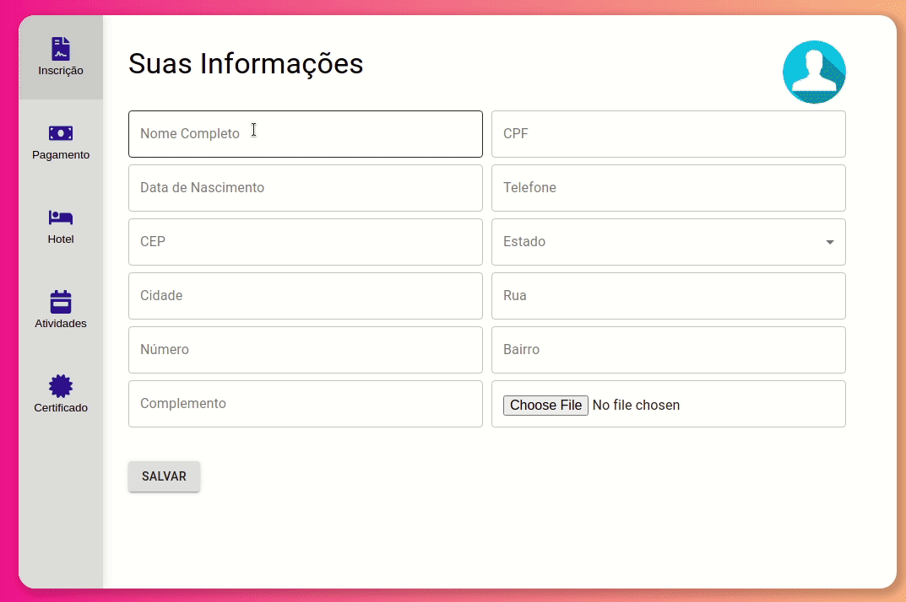

# E-vent :tickets:
A helpful tool to create events :tada:
## Preview 👀
 
#### [Click here and try it now!](https://drivent-front-lyart.vercel.app/)
## About 🔎
This is an web aplication wich users can enroll yourselves in an event, choose between online or presential, choose lodges and get a certificate.
### Implemented features :heavy_check_mark:
- [x] Enrollment
- [x] Modalities categories (online or presential)
- [x] Logde options (with hotels or not)
- [x] Choose activies
- [x] Payment page
- [x] Certificate 
### Future improvements 🔮
- [ ] Mobile version
- [ ] Certificate only at the end of event
## Tech tools 🔧
The following tools and frameworks were used in the construction of the project:<br>
<p>
  
  
  
  
  
  
  
  
  
  
  
  
  
  
  
  
</p>

## How to run ⚙️

1. Clone this repository
2. Install all dependencies
```bash
npm i
```
3. Create a PostgreSQL database with whatever name you want
4. Configure the `.env` file using the `.env.example` file
5. Run all migrations
```bash
npm run migration:run
```
6. Run the back-end in a development environment:
```bash
npm run dev
```
7. Or build it and run it in production environment:
```bash
npm run build
npm start
```
